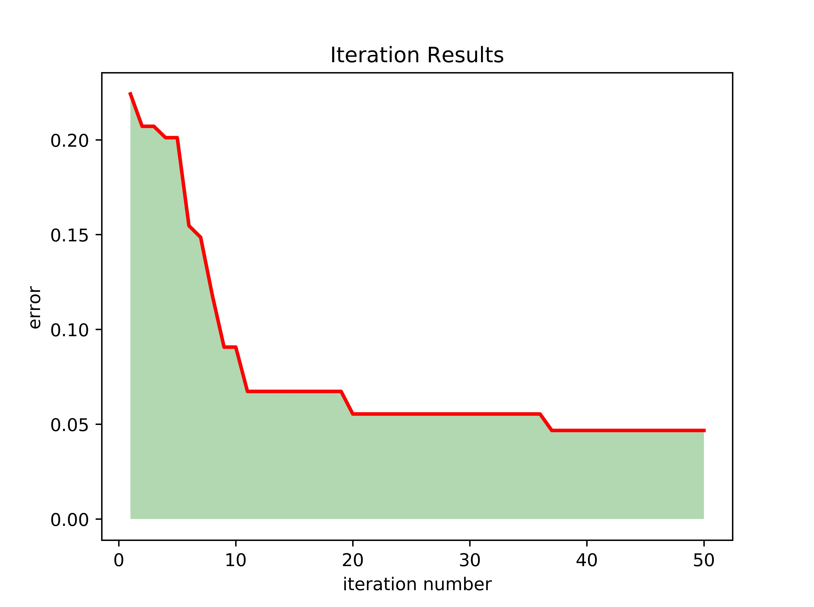

## ACO-GRNN

### Download

```g
git clone https://github.com/erwangccc/ACO-GRNN
```


### setup for ACO-GRNN

You can set up this project at ACO_GRNN.py.


### run ACO-GRNN

```python
python ACO-GRNN.py
```

### results

The optimized results of GRNN are as follows:




### credits:

I referred to many fantastic repos during the implementation:

ACO part is forked from [TSP_ACO](https://github.com/DiamonJoy/TSP/tree/master/TPS-ACO)
